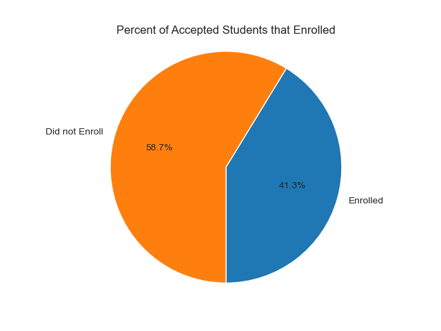
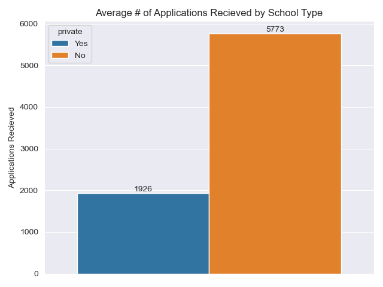
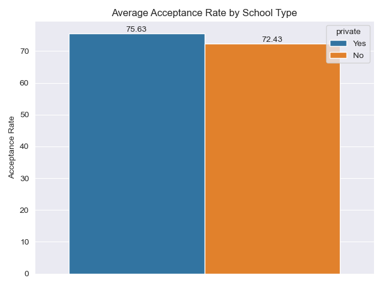

# College-Admissions

## Problem Statement
- This dataset contains information from various colleges in the United State, including the applications recieved, how many were accepted, graduation rates, student enrollment, etc. 

- In this analysis and prediction modeling, I would like to predict how many students will enroll out of the number accepted. This would be able to help colleges/universities plan for the academic year by knowing how many new students they should expect to have enroll. 

## Data Dictionary

| Column Name | Description |
|-------------|-------------|
| Private     | Private or Public School (Yes and No) |
| Apps     | Number of Applications Recieved |
| Accept         | Number of Applications Accepted         |
| Enroll         |  Number of new students enrolled |
| Top10perc         | Percent of new students from top 10% of High School Class |
| Top25perc         | Percent of new students from top 25% of High School Class |
| F.Undergrad         | Number of full time undergrads |
| P.Undergrad         | Number of part time undergrads |
| Outstate         | Out of state tuition |
| Room.Board         | Room and Board costs |
| Books         | Estimated Book Costs |
| Personal         | Estimated personal spending |
| PhD         | Percent of faculty with Ph.D's |
| S.F.Ratio         | Student/Faculty Ratio |
| perc.alumni         | percent alumni who donate |
| Expend         | Instructional expenditure per student |
|  Grad.Rate        | Graduation Rate |

## Executive Summary

### Data Cleaning Steps
As a part of the data cleaning process, I renamed the columns to be lowercase and have '_' instead of '.' where applicable. I also renamed the column "Unnamed: 0" to "university". 

Although at first glance there did not seem to be any missing values, the `PhD` column turned out to have '?' where there should be have been NaN values. There were 29 of these instances, and those values were converted to NaN and then subsequently dropped from the dataset, as there were relatively few of them. 

There were also some entry errors it seems, with one row having the `PhD` value, which is a percent, of 103, and another row had a `Grad.Rate`, another percent, value of 118. As you cannot go above 100%, these rows were removed. 

### Key Visualizations

#### Visualization 1: Percent of Accepted Students that Enrolled
The below pie chart show what percent of students who were accepted actually enrolled to the school. We see that most students do not enroll in the school they were accepted at. This would make sense, as students probably apply, and get accepted to, multiple school, but can only attend one.

#### Visualization 2: Applications Received by School Type
We see that, on average, public school recieve more applications than private schools.

#### Visualization 3: Acceptance Rate by School Type
The below barplot shows the average acceptance rate of public and private schools. The acceptance rates for both are very close, but private schools have a higher average acceptance rate.

## Conclusions/Recommendations
I trained multiple models to make predictions of how many students would enroll, namely, Linear Regression, Random Forest, and K Nearest Neighbors. 

The results are below. 

| Model | $R^2$ | RMSE |
| ----- | ----- | ---- |
| Linear Regression | 0.87 | 354 | 
| Random Forest | 0.87 | 357 |
| KNN | 0.86 | 380 |

For KNN, I used different neighbors, distance equations, and weights by using a GridSearch, but ultimately, the best performing KNN model did not beat Linear Regression. 

The Linear Regression model is able to explain 87% of the variability of the number of students enrolled, and, on average, accuratly predicts the number of enrolled students within 354 students. 

## Additional Information
Data comes from the [ISLR website](https://cran.r-project.org/web/packages/ISLR/ISLR.pdf) on page 5.

